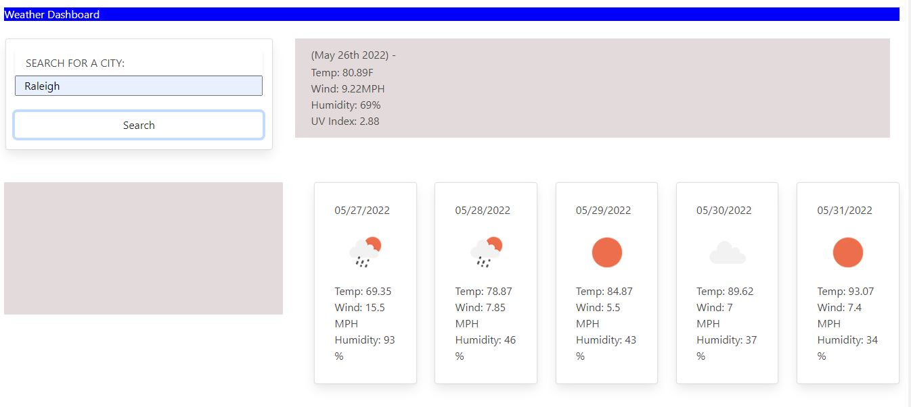

# weather-outlook

## Purpose
This weather dashboard is designed to help the user search for weather forecasts for various locations. Then the user searches for a city, current and future conditions are shown. This includes information about the temperature, humidity, wind speed, and UV index.A 5 day forecast is also provided for the city below the current weather conditions. 

## Built With
*HTML 
*CSS 
*JS 
*JQuery 
*Node 

## Web Link:
https://andrea-rowland.github.io/weather-outlook/

## Screenshot:
